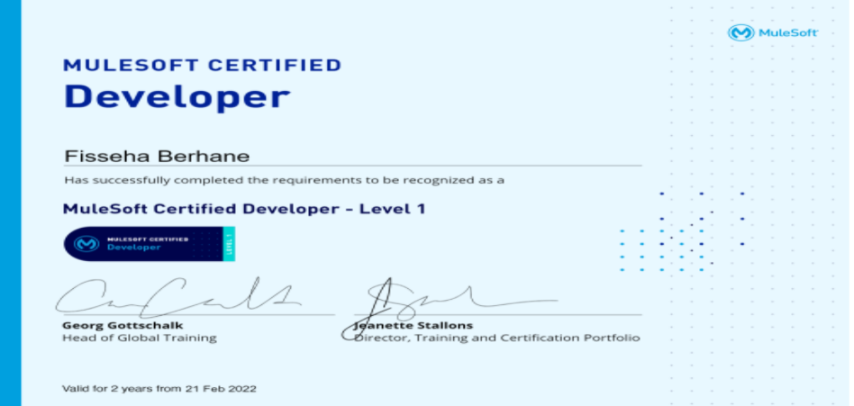

# MuleSoft

#### This repo contains tutorials on MuleSoft. You can visit my [website](https://mulesoft-enthusiast.com/mulesoft-tutorials/) for details. You can also get my YouTube MuleSoft tutorials [here](https://www.youtube.com/@mulesoftenthusiast2034/videos).

1. [Processing Continuously Coming Data Using File Connector in Mule 4 Part 1: process, rename and backup](https://github.com/fissehab/mulesoft/blob/main/Processing%20Continuously%20Coming%20Data%20Using%20File%20Connector%20in%20Mule%204.ipynb)

2.  [Processing Continuously Coming Data Using File Connector in Mule 4 part 2: inserting data into a database](https://github.com/fissehab/mulesoft/blob/main/Processing%20Continuously%20Coming%20Data%20%20Using%20File%20Connector%20and%20in%20Mule%204-Part%202.ipynb)

3.  [Processing Continuously Coming Data Using File Connector in Mule 4 part 3: inserting data into multiple databases in parallel](https://github.com/fissehab/mulesoft/blob/main/Processing%20Continuously%20Coming%20Data%20%20Using%20File%20Connector%20and%20in%20Mule%204-Part%203.ipynb)

4.  [Processing Continuously Coming Data Using File Connector in Mule 4 part 4: sending data to different destinations based on the data type](https://github.com/fissehab/mulesoft/blob/main/Processing%20Continuously%20Coming%20Data%20%20Using%20File%20Connector%20and%20in%20Mule%204-Part%204.ipynb)

5.  [Interacting With Databases in Mule 4: Part 1- Getting Data to Practice with](https://www.youtube.com/watch?v=K25aeJIqsQc)

6.  [ Interacting With Databases in Mule 4: Part 2- Getting Data using URI parameters and Query parameters](https://youtu.be/F3FRBskfJwc)

7.  [Interacting With Databases in Mule 4: Part 3- Inserting, updating and deleting](https://youtu.be/bcT17zOPCEA)

8.  [Interacting With Databases in Mule 4: Part 4- Fetching Data from Multiples Sources](https://www.youtube.com/watch?v=ZHNu44XwDNk)

9.  [Interacting With Databases in Mule 4: Part 5- First Successful Router for High Availability](https://www.youtube.com/watch?v=-MoXsnxQZUk)

10.  [Interacting With Databases in Mule 4: Part 6 – Bulk Insert and Bulk Update](https://www.youtube.com/watch?v=TqPc5AomvBs)

11.  [Integrating AWS Services in Mule 4-Part 1: S3 Automated Read and Write ](https://github.com/fissehab/mulesoft/blob/main/Integrating%20AWS%20Services%20in%20Mule%204-Part%201.ipynb)

12.  [Comparison of For Each, Parallel For Each, Batch Step and Batch Aggregator in Mule 4](https://youtu.be/jQSa7e8MUOo)

13.  [Automatic and Manual Watermarking in Mule 4](https://youtu.be/LmHrjUMslhs)

14.  [Using Application Properties](https://youtu.be/28eo-4MgYv0)

15.  [Return Data in Requested Format in Mule 4](https://www.youtube.com/watch?v=XFH-g_wp6sU)

16. [Integrating AWS Services in Mule 4 Part 2: reading data in different formats from S3 ](https://www.youtube.com/watch?v=OBKKYs8LVE8)

17. [Integrating AWS Redshift and Google BigQuery in Mule 4](https://www.youtube.com/watch?v=cD1gMBWYZaQ)